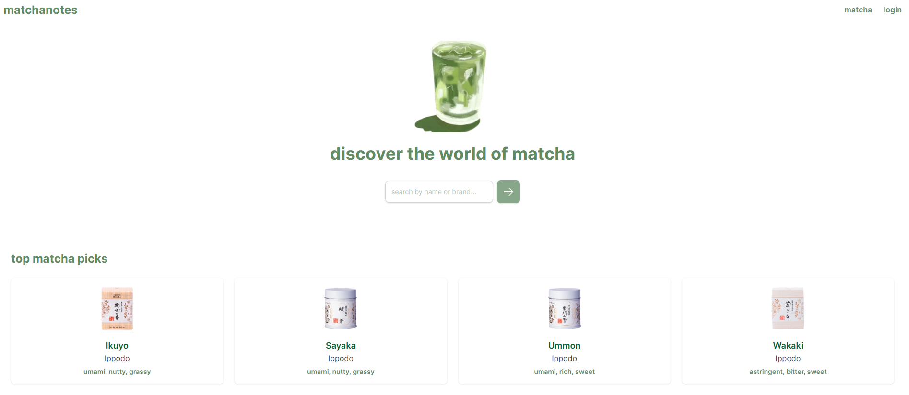
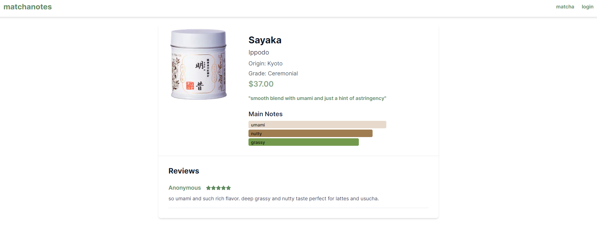
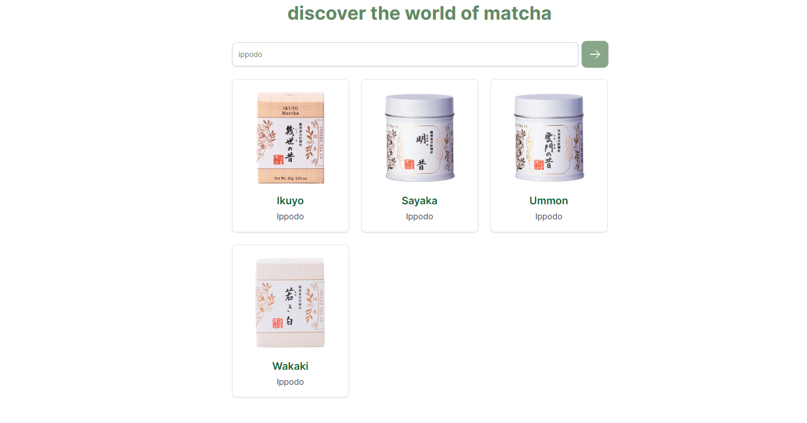

# 🍵matchanotes 

A full-stack web application that allows users to explore, review, and discover matcha powders from around the world. Inspired by sites like Fragrantica but tailored for matcha enthusiasts, the platform features full-text search, user-generated notes, and curated product pages to help users find their perfect matcha.

## Tech Stack

**Client:** Next.js, React, TypeScript, Tailwind CSS

**Server:** Supabase(PostgreSQL), Redis

## Screenshots

## Environment Variables

To run this project, you will need to add the following environment variables to your .env file

`PUBLIC_SUPABASE_URL`

`PUBLIC_SUPABASE_ANON_KEY`
` `

